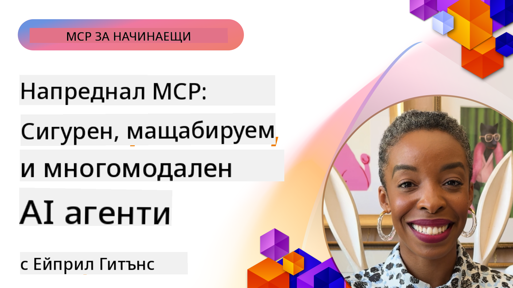

<!--
CO_OP_TRANSLATOR_METADATA:
{
  "original_hash": "d204bc94ea6027d06a703b21b711ca57",
  "translation_date": "2025-08-18T16:23:08+00:00",
  "source_file": "05-AdvancedTopics/README.md",
  "language_code": "bg"
}
-->
# Разширени теми в MCP

_(Кликнете върху изображението по-горе, за да гледате видеото на този урок)_

Тази глава обхваща серия от разширени теми в имплементацията на Model Context Protocol (MCP), включително мултимодална интеграция, мащабируемост, най-добри практики за сигурност и интеграция в предприятия. Тези теми са от съществено значение за изграждането на надеждни и готови за производство MCP приложения, които могат да отговорят на изискванията на съвременните AI системи.

## Преглед

Този урок разглежда разширени концепции в имплементацията на Model Context Protocol, като се фокусира върху мултимодална интеграция, мащабируемост, най-добри практики за сигурност и интеграция в предприятия. Тези теми са ключови за изграждането на MCP приложения от производствен клас, които могат да се справят със сложни изисквания в корпоративни среди.

## Цели на обучението

До края на този урок ще можете да:

- Имплементирате мултимодални възможности в рамките на MCP
- Проектирате мащабируеми MCP архитектури за сценарии с високо натоварване
- Прилагате най-добрите практики за сигурност, съобразени с принципите на MCP
- Интегрирате MCP с корпоративни AI системи и рамки
- Оптимизирате производителността и надеждността в производствени среди

## Уроци и примерни проекти

| Връзка | Заглавие | Описание |
|--------|----------|----------|
| [5.1 Интеграция с Azure](./mcp-integration/README.md) | Интеграция с Azure | Научете как да интегрирате вашия MCP сървър в Azure |
| [5.2 Мултимодален пример](./mcp-multi-modality/README.md) | MCP Мултимодални примери | Примери за аудио, изображения и мултимодални отговори |
| [5.3 MCP OAuth2 пример](../../../05-AdvancedTopics/mcp-oauth2-demo) | MCP OAuth2 Демонстрация | Минимално Spring Boot приложение, показващо OAuth2 с MCP, както като Authorization, така и като Resource Server. Демонстрира издаване на защитени токени, защитени крайни точки, разгръщане в Azure Container Apps и интеграция с API Management. |
| [5.4 Root Contexts](./mcp-root-contexts/README.md) | Root Contexts | Научете повече за root контекстите и как да ги имплементирате |
| [5.5 Роутинг](./mcp-routing/README.md) | Роутинг | Научете различни видове роутинг |
| [5.6 Семплиране](./mcp-sampling/README.md) | Семплиране | Научете как да работите със семплиране |
| [5.7 Мащабиране](./mcp-scaling/README.md) | Мащабиране | Научете за мащабирането |
| [5.8 Сигурност](./mcp-security/README.md) | Сигурност | Защитете вашия MCP сървър |
| [5.9 Пример за уеб търсене](./web-search-mcp/README.md) | Уеб търсене MCP | Python MCP сървър и клиент, интегриращи се със SerpAPI за реално време уеб, новини, продуктово търсене и Q&A. Демонстрира мулти-инструментална оркестрация, интеграция с външни API и надеждно управление на грешки. |
| [5.10 Поточно предаване в реално време](./mcp-realtimestreaming/README.md) | Поточно предаване | Поточното предаване на данни в реално време е от съществено значение в днешния свят, ориентиран към данни, където бизнесите и приложенията изискват незабавен достъп до информация за вземане на навременни решения. |
| [5.11 Уеб търсене в реално време](./mcp-realtimesearch/README.md) | Уеб търсене | Как MCP трансформира уеб търсенето в реално време, предоставяйки стандартизиран подход към управлението на контекста между AI модели, търсачки и приложения. |
| [5.12 Entra ID Аутентикация за MCP сървъри](./mcp-security-entra/README.md) | Entra ID Аутентикация | Microsoft Entra ID предоставя надеждно облачно решение за управление на идентичности и достъп, което гарантира, че само оторизирани потребители и приложения могат да взаимодействат с вашия MCP сървър. |
| [5.13 Интеграция с Azure AI Foundry Agent](./mcp-foundry-agent-integration/README.md) | Интеграция с Azure AI Foundry | Научете как да интегрирате MCP сървъри с Azure AI Foundry агенти, позволявайки мощна оркестрация на инструменти и корпоративни AI възможности със стандартизирани връзки към външни източници на данни. |
| [5.14 Инженеринг на контекста](./mcp-contextengineering/README.md) | Инженеринг на контекста | Бъдещите възможности на техниките за инженеринг на контекста за MCP сървъри, включително оптимизация на контекста, динамично управление на контекста и стратегии за ефективно инженерство на подканите в рамките на MCP. |

## Допълнителни референции

За най-актуалната информация относно разширените теми на MCP, вижте:
- [MCP Документация](https://modelcontextprotocol.io/)
- [MCP Спецификация](https://spec.modelcontextprotocol.io/)
- [GitHub Репозитори](https://github.com/modelcontextprotocol)

## Основни изводи

- Мултимодалните имплементации на MCP разширяват AI възможностите отвъд текстовата обработка
- Мащабируемостта е от съществено значение за корпоративни внедрения и може да бъде постигната чрез хоризонтално и вертикално мащабиране
- Комплексни мерки за сигурност защитават данните и осигуряват правилен контрол на достъпа
- Интеграцията с платформи като Azure OpenAI и Microsoft AI Foundry подобрява възможностите на MCP
- Разширените имплементации на MCP се възползват от оптимизирани архитектури и внимателно управление на ресурсите

## Упражнение

Проектирайте MCP имплементация от корпоративен клас за конкретен случай на употреба:

1. Идентифицирайте мултимодалните изисквания за вашия случай на употреба
2. Очертайте контролните мерки за сигурност, необходими за защита на чувствителни данни
3. Проектирайте мащабируема архитектура, която може да се справи с променливо натоварване
4. Планирайте точки на интеграция с корпоративни AI системи
5. Документирайте потенциални тесни места в производителността и стратегии за тяхното преодоляване

## Допълнителни ресурси

- [Azure OpenAI Документация](https://learn.microsoft.com/en-us/azure/ai-services/openai/)
- [Microsoft AI Foundry Документация](https://learn.microsoft.com/en-us/ai-services/)

---

## Какво следва

- [5.1 MCP Интеграция](./mcp-integration/README.md)

**Отказ от отговорност**:  
Този документ е преведен с помощта на AI услуга за превод [Co-op Translator](https://github.com/Azure/co-op-translator). Въпреки че се стремим към точност, моля, имайте предвид, че автоматизираните преводи може да съдържат грешки или неточности. Оригиналният документ на неговия роден език трябва да се счита за авторитетен източник. За критична информация се препоръчва професионален човешки превод. Ние не носим отговорност за недоразумения или погрешни интерпретации, произтичащи от използването на този превод.