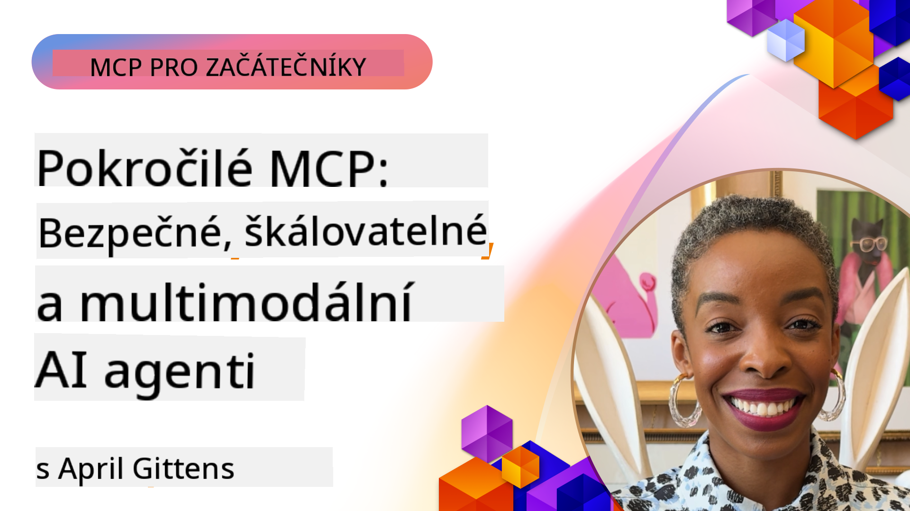

<!--
CO_OP_TRANSLATOR_METADATA:
{
  "original_hash": "d204bc94ea6027d06a703b21b711ca57",
  "translation_date": "2025-08-18T15:01:08+00:00",
  "source_file": "05-AdvancedTopics/README.md",
  "language_code": "cs"
}
-->
# Pokročilá témata v MCP

_(Klikněte na obrázek výše pro zhlédnutí videa této lekce)_

Tato kapitola pokrývá sérii pokročilých témat implementace Model Context Protocol (MCP), včetně multimodální integrace, škálovatelnosti, osvědčených bezpečnostních postupů a integrace do podnikových prostředí. Tato témata jsou klíčová pro vytváření robustních a produkčně připravených MCP aplikací, které splňují požadavky moderních AI systémů.

## Přehled

Tato lekce se zaměřuje na pokročilé koncepty implementace Model Context Protocol, se zaměřením na multimodální integraci, škálovatelnost, osvědčené bezpečnostní postupy a integraci do podnikových prostředí. Tato témata jsou nezbytná pro vytváření produkčně připravených MCP aplikací, které zvládnou složité požadavky v podnikových prostředích.

## Cíle učení

Na konci této lekce budete schopni:

- Implementovat multimodální funkce v rámci MCP frameworků
- Navrhnout škálovatelné MCP architektury pro scénáře s vysokými nároky
- Aplikovat osvědčené bezpečnostní postupy v souladu s bezpečnostními principy MCP
- Integrovat MCP s podnikovými AI systémy a frameworky
- Optimalizovat výkon a spolehlivost v produkčním prostředí

## Lekce a ukázkové projekty

| Odkaz | Název | Popis |
|-------|-------|-------|
| [5.1 Integrace s Azure](./mcp-integration/README.md) | Integrace s Azure | Naučte se, jak integrovat váš MCP server na Azure |
| [5.2 Multimodální ukázka](./mcp-multi-modality/README.md) | Multimodální ukázky MCP | Ukázky pro audio, obraz a multimodální odpovědi |
| [5.3 Ukázka MCP OAuth2](../../../05-AdvancedTopics/mcp-oauth2-demo) | Ukázka MCP OAuth2 | Minimalistická Spring Boot aplikace ukazující OAuth2 s MCP, jak jako Authorization, tak Resource Server. Demonstruje vydávání bezpečných tokenů, chráněné endpointy, nasazení na Azure Container Apps a integraci s API Management. |
| [5.4 Kořenové kontexty](./mcp-root-contexts/README.md) | Kořenové kontexty | Naučte se více o kořenových kontextech a jak je implementovat |
| [5.5 Směrování](./mcp-routing/README.md) | Směrování | Naučte se různé typy směrování |
| [5.6 Vzorkování](./mcp-sampling/README.md) | Vzorkování | Naučte se pracovat se vzorkováním |
| [5.7 Škálování](./mcp-scaling/README.md) | Škálování | Naučte se o škálování |
| [5.8 Bezpečnost](./mcp-security/README.md) | Bezpečnost | Zabezpečte svůj MCP server |
| [5.9 Ukázka webového vyhledávání](./web-search-mcp/README.md) | Webové vyhledávání MCP | Python MCP server a klient integrující se SerpAPI pro real-time webové, zpravodajské, produktové vyhledávání a Q&A. Demonstruje orchestraci více nástrojů, integraci externích API a robustní zpracování chyb. |
| [5.10 Reálné časové streamování](./mcp-realtimestreaming/README.md) | Streamování | Reálné časové streamování je dnes nezbytné ve světě řízeném daty, kde podniky a aplikace potřebují okamžitý přístup k informacím pro včasné rozhodování. |
| [5.11 Reálné časové webové vyhledávání](./mcp-realtimesearch/README.md) | Webové vyhledávání | Jak MCP transformuje reálné časové webové vyhledávání poskytováním standardizovaného přístupu ke správě kontextu napříč AI modely, vyhledávači a aplikacemi. |
| [5.12 Ověřování Entra ID pro servery Model Context Protocol](./mcp-security-entra/README.md) | Ověřování Entra ID | Microsoft Entra ID poskytuje robustní cloudové řešení pro správu identity a přístupu, které pomáhá zajistit, že pouze autorizovaní uživatelé a aplikace mohou interagovat s vaším MCP serverem. |
| [5.13 Integrace agenta Azure AI Foundry](./mcp-foundry-agent-integration/README.md) | Integrace Azure AI Foundry | Naučte se, jak integrovat servery Model Context Protocol s agenty Azure AI Foundry, což umožňuje výkonnou orchestraci nástrojů a podnikové AI schopnosti se standardizovanými připojeními k externím datovým zdrojům. |
| [5.14 Kontextové inženýrství](./mcp-contextengineering/README.md) | Kontextové inženýrství | Budoucí příležitosti technik kontextového inženýrství pro MCP servery, včetně optimalizace kontextu, dynamické správy kontextu a strategií pro efektivní návrh promptů v rámci MCP frameworků. |

## Další odkazy

Pro nejaktuálnější informace o pokročilých tématech MCP se podívejte na:
- [MCP Dokumentace](https://modelcontextprotocol.io/)
- [MCP Specifikace](https://spec.modelcontextprotocol.io/)
- [GitHub Repozitář](https://github.com/modelcontextprotocol)

## Klíčové poznatky

- Multimodální implementace MCP rozšiřují schopnosti AI nad rámec zpracování textu
- Škálovatelnost je klíčová pro podniková nasazení a lze ji řešit horizontálním i vertikálním škálováním
- Komplexní bezpečnostní opatření chrání data a zajišťují správnou kontrolu přístupu
- Podniková integrace s platformami jako Azure OpenAI a Microsoft AI Foundry zvyšuje schopnosti MCP
- Pokročilé implementace MCP těží z optimalizovaných architektur a pečlivého řízení zdrojů

## Cvičení

Navrhněte podnikové řešení MCP pro konkrétní případ použití:

1. Identifikujte multimodální požadavky pro váš případ použití
2. Nastíněte bezpečnostní opatření potřebná k ochraně citlivých dat
3. Navrhněte škálovatelnou architekturu, která zvládne proměnlivé zatížení
4. Naplánujte integrační body s podnikovými AI systémy
5. Dokumentujte potenciální úzká místa výkonu a strategie jejich zmírnění

## Další zdroje

- [Dokumentace Azure OpenAI](https://learn.microsoft.com/en-us/azure/ai-services/openai/)
- [Dokumentace Microsoft AI Foundry](https://learn.microsoft.com/en-us/ai-services/)

---

## Co dál

- [5.1 Integrace MCP](./mcp-integration/README.md)

**Prohlášení:**  
Tento dokument byl přeložen pomocí služby pro automatický překlad [Co-op Translator](https://github.com/Azure/co-op-translator). Ačkoli se snažíme o přesnost, mějte prosím na paměti, že automatické překlady mohou obsahovat chyby nebo nepřesnosti. Původní dokument v jeho původním jazyce by měl být považován za autoritativní zdroj. Pro důležité informace se doporučuje profesionální lidský překlad. Neodpovídáme za žádná nedorozumění nebo nesprávné interpretace vyplývající z použití tohoto překladu.