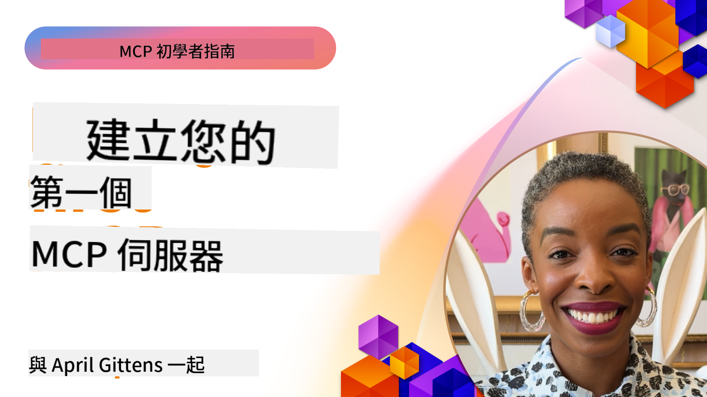

<!--
CO_OP_TRANSLATOR_METADATA:
{
  "original_hash": "858362ce0118de3fec0f9114bf396101",
  "translation_date": "2025-08-18T14:38:41+00:00",
  "source_file": "03-GettingStarted/README.md",
  "language_code": "mo"
}
-->
## 開始使用  

_（點擊上方圖片觀看本課程的影片）_

本節包含以下幾個課程：

- **1 您的第一個伺服器**，在這第一課中，您將學習如何建立您的第一個伺服器，並使用檢查工具進行檢查，這是一種測試和除錯伺服器的寶貴方式，[前往課程](01-first-server/README.md)

- **2 客戶端**，在這一課中，您將學習如何撰寫一個可以連接到伺服器的客戶端，[前往課程](02-client/README.md)

- **3 使用 LLM 的客戶端**，更進一步的方式是為客戶端添加 LLM，使其能夠與伺服器進行「協商」，[前往課程](03-llm-client/README.md)

- **4 在 Visual Studio Code 中以 GitHub Copilot Agent 模式運行伺服器**，這一課將介紹如何在 Visual Studio Code 中運行 MCP 伺服器，[前往課程](04-vscode/README.md)

- **5 使用 SSE（伺服器推送事件）**，SSE 是一種伺服器到客戶端的串流標準，允許伺服器通過 HTTP 向客戶端推送即時更新，[前往課程](05-sse-server/README.md)

- **6 使用 MCP 的 HTTP 串流（可串流的 HTTP）**，學習現代 HTTP 串流、進度通知，以及如何使用可串流的 HTTP 實現可擴展的即時 MCP 伺服器和客戶端，[前往課程](06-http-streaming/README.md)

- **7 使用 VSCode 的 AI 工具包**，用於消費和測試您的 MCP 客戶端和伺服器，[前往課程](07-aitk/README.md)

- **8 測試**，本課將特別關注如何以不同方式測試伺服器和客戶端，[前往課程](08-testing/README.md)

- **9 部署**，本章將探討部署 MCP 解決方案的不同方式，[前往課程](09-deployment/README.md)

Model Context Protocol（MCP）是一種開放協議，標準化應用程式如何向 LLM 提供上下文。可以將 MCP 想像成 AI 應用程式的 USB-C 接口——它提供了一種標準化的方式來連接 AI 模型與不同的數據來源和工具。

## 學習目標

完成本課程後，您將能夠：

- 為 C#、Java、Python、TypeScript 和 JavaScript 設置 MCP 開發環境  
- 建立並部署具有自定義功能（資源、提示和工具）的基本 MCP 伺服器  
- 創建連接到 MCP 伺服器的主機應用程式  
- 測試和除錯 MCP 實現  
- 理解常見的設置挑戰及其解決方案  
- 將您的 MCP 實現連接到流行的 LLM 服務  

## 設置您的 MCP 環境

在開始使用 MCP 之前，準備好開發環境並了解基本工作流程非常重要。本節將指導您完成初始設置步驟，以確保順利開始使用 MCP。

### 先決條件

在進入 MCP 開發之前，請確保您已具備以下條件：

- **開發環境**：適用於您選擇的語言（C#、Java、Python、TypeScript 或 JavaScript）  
- **IDE/編輯器**：Visual Studio、Visual Studio Code、IntelliJ、Eclipse、PyCharm 或任何現代代碼編輯器  
- **套件管理工具**：NuGet、Maven/Gradle、pip 或 npm/yarn  
- **API 金鑰**：用於您計劃在主機應用程式中使用的任何 AI 服務  

### 官方 SDK

在接下來的章節中，您將看到使用 Python、TypeScript、Java 和 .NET 構建的解決方案。以下是所有官方支持的 SDK。

MCP 提供多種語言的官方 SDK：
- [C# SDK](https://github.com/modelcontextprotocol/csharp-sdk) - 與 Microsoft 合作維護  
- [Java SDK](https://github.com/modelcontextprotocol/java-sdk) - 與 Spring AI 合作維護  
- [TypeScript SDK](https://github.com/modelcontextprotocol/typescript-sdk) - 官方 TypeScript 實現  
- [Python SDK](https://github.com/modelcontextprotocol/python-sdk) - 官方 Python 實現  
- [Kotlin SDK](https://github.com/modelcontextprotocol/kotlin-sdk) - 官方 Kotlin 實現  
- [Swift SDK](https://github.com/modelcontextprotocol/swift-sdk) - 與 Loopwork AI 合作維護  
- [Rust SDK](https://github.com/modelcontextprotocol/rust-sdk) - 官方 Rust 實現  

## 關鍵要點

- 使用語言特定的 SDK 設置 MCP 開發環境非常簡單  
- 構建 MCP 伺服器涉及創建並註冊具有清晰架構的工具  
- MCP 客戶端連接到伺服器和模型以利用擴展功能  
- 測試和除錯對於可靠的 MCP 實現至關重要  
- 部署選項從本地開發到基於雲的解決方案不等  

## 練習

我們提供了一組範例，補充了本節所有章節中的練習。此外，每個章節還有自己的練習和作業。

- [Java 計算器](./samples/java/calculator/README.md)  
- [.Net 計算器](../../../03-GettingStarted/samples/csharp)  
- [JavaScript 計算器](./samples/javascript/README.md)  
- [TypeScript 計算器](./samples/typescript/README.md)  
- [Python 計算器](../../../03-GettingStarted/samples/python)  

## 其他資源

- [使用 Model Context Protocol 在 Azure 上構建代理](https://learn.microsoft.com/azure/developer/ai/intro-agents-mcp)  
- [使用 Azure 容器應用程式進行遠程 MCP（Node.js/TypeScript/JavaScript）](https://learn.microsoft.com/samples/azure-samples/mcp-container-ts/mcp-container-ts/)  
- [.NET OpenAI MCP 代理](https://learn.microsoft.com/samples/azure-samples/openai-mcp-agent-dotnet/openai-mcp-agent-dotnet/)  

## 下一步

下一步：[建立您的第一個 MCP 伺服器](01-first-server/README.md)  

**免責聲明**：  
此文件已使用 AI 翻譯服務 [Co-op Translator](https://github.com/Azure/co-op-translator) 進行翻譯。我們致力於提供準確的翻譯，但請注意，自動翻譯可能包含錯誤或不準確之處。應以原始語言的文件作為權威來源。對於關鍵資訊，建議尋求專業人工翻譯。我們對因使用此翻譯而引起的任何誤解或錯誤解讀概不負責。