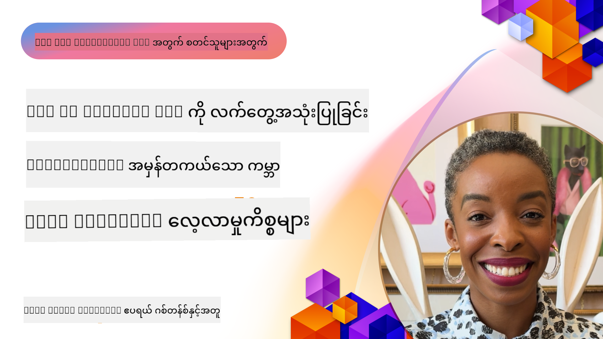

<!--
CO_OP_TRANSLATOR_METADATA:
{
  "original_hash": "61a160248efabe92b09d7b08293d17db",
  "translation_date": "2025-08-19T18:29:32+00:00",
  "source_file": "09-CaseStudy/README.md",
  "language_code": "my"
}
-->
# MCP ကို လက်တွေ့အသုံးချခြင်း - အမှန်တကယ်ဖြစ်ရပ်များ

_(ဤသင်ခန်းစာ၏ ဗီဒီယိုကို ကြည့်ရန် အထက်ပါပုံကို နှိပ်ပါ)_

Model Context Protocol (MCP) သည် AI အက်ပလီကေးရှင်းများအနေဖြင့် ဒေတာ၊ ကိရိယာများနှင့် ဝန်ဆောင်မှုများနှင့် အပြန်အလှန်ဆက်သွယ်ပုံကို ပြောင်းလဲစေပါသည်။ ဤအပိုင်းတွင် MCP ကို အလုပ်အကိုင်လုပ်ငန်းများတွင် လက်တွေ့အသုံးချပုံကို ပြသသည့် အမှန်တကယ်ဖြစ်ရပ်များကို တင်ပြထားပါသည်။

## အကျဉ်းချုပ်

ဤအပိုင်းတွင် MCP ကို အဖွဲ့အစည်းများက စိန်ခေါ်မှုများကို ဖြေရှင်းရန် အသုံးချပုံကို ပြသသည့် လက်တွေ့ตัวอย่างများကို တင်ပြထားသည်။ ဤဖြစ်ရပ်များကို လေ့လာခြင်းအားဖြင့် MCP ၏ အကျိုးကျေးဇူးများ၊ အကွေ့အကွက်များနှင့် လက်တွေ့အသုံးချမှုများကို နားလည်နိုင်မည်ဖြစ်သည်။

## အဓိက သင်ယူရမည့်အချက်များ

ဤဖြစ်ရပ်များကို လေ့လာခြင်းအားဖြင့် သင်သည်-

- MCP ကို အထူးလုပ်ငန်းပြဿနာများကို ဖြေရှင်းရန် အသုံးချပုံကို နားလည်နိုင်မည်
- ပေါင်းစည်းမှုပုံစံများနှင့် အဆောက်အအုံဆိုင်ရာ နည်းလမ်းများကို သင်ယူနိုင်မည်
- MCP ကို အလုပ်အကိုင်ပတ်ဝန်းကျင်တွင် အကောင်းဆုံးအသုံးချနည်းလမ်းများကို သိရှိနိုင်မည်
- လက်တွေ့အသုံးချမှုများတွင် ကြုံတွေ့ရသော စိန်ခေါ်မှုများနှင့် ဖြေရှင်းနည်းများကို နားလည်နိုင်မည်
- ကိုယ်ပိုင်ပရောဂျက်များတွင် အလားတူပုံစံများကို အသုံးချနိုင်မည့် အခွင့်အလမ်းများကို ရှာဖွေနိုင်မည်

## အထူးပြသထားသော ဖြစ်ရပ်များ

### 1. [Azure AI ခရီးသွားအေးဂျင့်များ – ကိုးကားမှု အကောင်အထည်ဖော်မှု](./travelagentsample.md)

ဤဖြစ်ရပ်တွင် MCP၊ Azure OpenAI နှင့် Azure AI Search ကို အသုံးပြု၍ AI အားဖြင့် အင်အားပေးထားသော ခရီးသွားအစီအစဉ်ဆိုင်ရာ အက်ပလီကေးရှင်းတစ်ခုကို တည်ဆောက်ပုံကို Microsoft ၏ အပြည့်အစုံကိုးကားမှုဖြေရှင်းနည်းကို လေ့လာနိုင်သည်။ ဤပရောဂျက်တွင်-

- MCP ဖြင့် Multi-agent စီမံခန့်ခွဲမှု
- Azure AI Search ဖြင့် လုပ်ငန်းဒေတာပေါင်းစည်းမှု
- Azure ဝန်ဆောင်မှုများကို အသုံးပြု၍ လုံခြုံပြီး အတိုင်းအတာကျသော အဆောက်အအုံ
- MCP components များကို ပြန်လည်အသုံးပြုနိုင်သော ကိရိယာများ
- Azure OpenAI ဖြင့် စကားပြောအတွေ့အကြုံ

ဤအဆောက်အအုံနှင့် အကောင်အထည်ဖော်မှုအသေးစိတ်များသည် MCP ကို စီမံခန့်ခွဲမှုအလွှာအဖြစ် အသုံးပြု၍ Multi-agent စနစ်များကို တည်ဆောက်ပုံအပေါ် အထောက်အကူဖြစ်စေသည်။

### 2. [YouTube ဒေတာမှ Azure DevOps အချက်အလက်များကို အပ်ဒိတ်လုပ်ခြင်း](./UpdateADOItemsFromYT.md)

ဤဖြစ်ရပ်သည် MCP ကို workflow အလိုအလျောက်လုပ်ငန်းစဉ်များအတွက် လက်တွေ့အသုံးချပုံကို ပြသသည်။ MCP tools များကို အသုံးပြု၍-

- အွန်လိုင်းပလက်ဖောင်းများ (YouTube) မှ ဒေတာထုတ်ယူခြင်း
- Azure DevOps စနစ်များတွင် အလုပ် items များကို အပ်ဒိတ်လုပ်ခြင်း
- အလိုအလျောက်လုပ်ငန်းစဉ်များကို ပြန်လည်အသုံးပြုနိုင်သော ပုံစံဖြင့် ဖန်တီးခြင်း
- မတူကွဲပြားသော စနစ်များအကြား ဒေတာပေါင်းစည်းခြင်း

ဤဥပမာသည် MCP ကို အသုံးပြု၍ ရိုးရှင်းသော အကောင်အထည်ဖော်မှုများမှ စနစ်တကျလုပ်ငန်းစဉ်များကို အချိန်ကုန်သက်သာစေခြင်းနှင့် ဒေတာအကျိုးရှိမှုကို တိုးတက်စေခြင်းအထိ အကျိုးကျေးဇူးများကို ပြသသည်။

### 3. [MCP ဖြင့် အချိန်နှင့်တပြေးညီ Documentation ရှာဖွေခြင်း](./docs-mcp/README.md)

ဤဖြစ်ရပ်သည် Python console client ကို MCP server နှင့် ချိတ်ဆက်၍ Microsoft documentation ကို အချိန်နှင့်တပြေးညီ ရှာဖွေခြင်းနှင့် log လုပ်ခြင်းကို လမ်းညွှန်သည်။ သင်သည်-

- Python client နှင့် MCP SDK ကို အသုံးပြု၍ MCP server သို့ ချိတ်ဆက်ခြင်း
- streaming HTTP clients ကို အသုံးပြု၍ အချိန်နှင့်တပြေးညီ ဒေတာထုတ်ယူခြင်း
- server တွင် documentation tools များကို ခေါ်ယူပြီး console တွင် တိုက်ရိုက် log လုပ်ခြင်း
- terminal မှ မထွက်ဘဲ Microsoft documentation ကို workflow တွင် ပေါင်းစည်းခြင်း

ဤအခန်းတွင် လက်တွေ့လုပ်ငန်းခွင်အတွက် လုပ်ငန်းခွင်ကိုယ်တိုင် code sample များနှင့် အရင်းအမြစ်များကို ထည့်သွင်းထားသည်။

### 4. [MCP ဖြင့် Interactive Study Plan Generator Web App](./docs-mcp/README.md)

ဤဖြစ်ရပ်သည် Chainlit နှင့် MCP ကို အသုံးပြု၍ ကိုယ်ပိုင်သင်ကြားရေးအစီအစဉ်များကို ဖန်တီးပေးသော interactive web application တစ်ခုကို တည်ဆောက်ပုံကို ပြသသည်။ Chainlit သည် စကားပြော chat interface ကို ပံ့ပိုးပေးပြီး အတွေ့အကြုံကို စိတ်ဝင်စားဖွယ်ဖြစ်စေသည်။

- Chainlit ဖြင့် conversational web app
- ခေါင်းစဉ်နှင့် အချိန်ကာလကို သုံးစွဲသူမှ သတ်မှတ်ခြင်း
- MCP ကို အသုံးပြု၍ အပတ်စဉ် content အကြံပေးချက်များ
- chat interface တွင် အချိန်နှင့်တပြေးညီ adaptive အဖြေများ

ဤပရောဂျက်သည် conversational AI နှင့် MCP ကို ပေါင်းစည်း၍ သင်ကြားရေးကိရိယာများကို ဖန်တီးပုံကို ပြသသည်။

### 5. [VS Code တွင် MCP Server ဖြင့် In-Editor Docs](./docs-mcp/README.md)

ဤဖြစ်ရပ်သည် MCP server ကို အသုံးပြု၍ Microsoft Learn Docs ကို VS Code အတွင်းသို့ တိုက်ရိုက်ရယူပုံကို ပြသသည်။ Browser tabs များကို ပြောင်းရန် မလိုတော့ပါ။

- MCP panel သို့မဟုတ် command palette ကို အသုံးပြု၍ VS Code အတွင်း docs ရှာဖွေခြင်း
- README သို့မဟုတ် markdown files တွင် documentation links ထည့်သွင်းခြင်း
- GitHub Copilot နှင့် MCP ကို ပေါင်းစည်း၍ documentation နှင့် code workflows ကို ပိုမိုထိရောက်စေခြင်း
- Microsoft မှ sourced accuracy ဖြင့် documentation ကို အတည်ပြုခြင်း
- GitHub workflows နှင့် MCP ကို ပေါင်းစည်း၍ documentation validation ကို ဆက်လက်လုပ်ဆောင်ခြင်း

ဤအကောင်အထည်ဖော်မှုတွင် `.vscode/mcp.json` configuration နမူနာနှင့် walkthroughs များပါဝင်သည်။

### 6. [APIM MCP Server ဖန်တီးခြင်း](./apimsample.md)

ဤဖြစ်ရပ်သည် Azure API Management (APIM) ကို အသုံးပြု၍ MCP server တစ်ခုကို ဖန်တီးပုံကို လမ်းညွှန်သည်။ ဤအပိုင်းတွင်-

- Azure API Management တွင် MCP server တစ်ခုကို စတင်တည်ဆောက်ခြင်း
- API operations များကို MCP tools အဖြစ် ဖော်ထုတ်ခြင်း
- rate limiting နှင့် လုံခြုံရေးအတွက် policies များကို configure လုပ်ခြင်း
- Visual Studio Code နှင့် GitHub Copilot ကို အသုံးပြု၍ MCP server ကို စမ်းသပ်ခြင်း

ဤဥပမာသည် Azure ၏ အင်အားကို အသုံးပြု၍ AI စနစ်များနှင့် Enterprise APIs များကို ပိုမိုထိရောက်စွာ ပေါင်းစည်းပုံကို ပြသသည်။

## နိဂုံး

ဤဖြစ်ရပ်များသည် Model Context Protocol ၏ အကွေ့အကွက်များနှင့် လက်တွေ့အသုံးချမှုများကို ပြသသည်။ Multi-agent စနစ်များမှ အလိုအလျောက်လုပ်ငန်းစဉ်များအထိ MCP သည် AI စနစ်များကို လိုအပ်သော tools နှင့် data များနှင့် ပေါင်းစည်းပေးသော စံပြနည်းလမ်းတစ်ခုဖြစ်သည်။

ဤအကောင်အထည်ဖော်မှုများကို လေ့လာခြင်းအားဖြင့် သင်သည် ကိုယ်ပိုင် MCP ပရောဂျက်များတွင် အသုံးချနိုင်သော အဆောက်အအုံပုံစံများ၊ အကောင်အထည်ဖော်မှုနည်းလမ်းများနှင့် အကောင်းဆုံးအလေ့အကျင့်များကို နားလည်နိုင်မည်ဖြစ်သည်။

## အပိုဆောင်းအရင်းအမြစ်များ

- [Azure AI Travel Agents GitHub Repository](https://github.com/Azure-Samples/azure-ai-travel-agents)
- [Azure DevOps MCP Tool](https://github.com/microsoft/azure-devops-mcp)
- [Playwright MCP Tool](https://github.com/microsoft/playwright-mcp)
- [Microsoft Docs MCP Server](https://github.com/MicrosoftDocs/mcp)
- [MCP Community Examples](https://github.com/microsoft/mcp)

Next: Hands on Lab [Streamlining AI Workflows: Building an MCP Server with AI Toolkit](../10-StreamliningAIWorkflowsBuildingAnMCPServerWithAIToolkit/README.md)

**ဝက်ဘ်ဆိုက်မှတ်ချက်**:  
ဤစာရွက်စာတမ်းကို AI ဘာသာပြန်ဝန်ဆောင်မှု [Co-op Translator](https://github.com/Azure/co-op-translator) ကို အသုံးပြု၍ ဘာသာပြန်ထားပါသည်။ ကျွန်ုပ်တို့သည် တိကျမှန်ကန်မှုအတွက် ကြိုးစားနေသော်လည်း၊ အလိုအလျောက်ဘာသာပြန်ခြင်းတွင် အမှားများ သို့မဟုတ် မမှန်ကန်မှုများ ပါဝင်နိုင်သည်ကို ကျေးဇူးပြု၍ သတိပြုပါ။ မူလဘာသာစကားဖြင့် ရေးသားထားသော စာရွက်စာတမ်းကို အာဏာတည်သော ရင်းမြစ်အဖြစ် သတ်မှတ်သင့်ပါသည်။ အရေးကြီးသော အချက်အလက်များအတွက် လူ့ဘာသာပြန်ပညာရှင်များကို အသုံးပြုရန် အကြံပြုပါသည်။ ဤဘာသာပြန်ကို အသုံးပြုခြင်းမှ ဖြစ်ပေါ်လာသော နားလည်မှုမှားများ သို့မဟုတ် အဓိပ္ပာယ်မှားများအတွက် ကျွန်ုပ်တို့သည် တာဝန်မယူပါ။ 