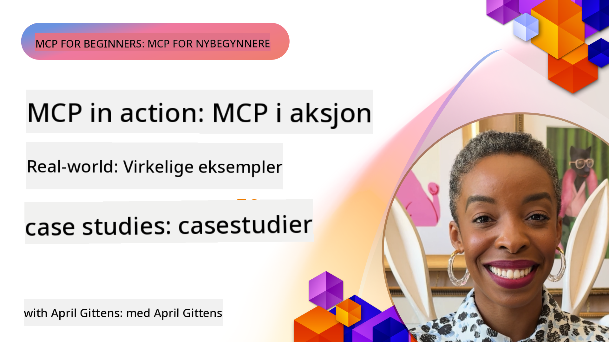

<!--
CO_OP_TRANSLATOR_METADATA:
{
  "original_hash": "61a160248efabe92b09d7b08293d17db",
  "translation_date": "2025-08-18T15:29:30+00:00",
  "source_file": "09-CaseStudy/README.md",
  "language_code": "no"
}
-->
# MCP i praksis: Virkelige casestudier

_(Klikk på bildet over for å se videoen til denne leksjonen)_

Model Context Protocol (MCP) endrer hvordan AI-applikasjoner samhandler med data, verktøy og tjenester. Denne delen presenterer virkelige casestudier som viser praktiske anvendelser av MCP i ulike bedriftsmiljøer.

## Oversikt

Denne delen fremhever konkrete eksempler på MCP-implementeringer og viser hvordan organisasjoner bruker protokollen til å løse komplekse forretningsutfordringer. Ved å studere disse casestudiene får du innsikt i MCPs allsidighet, skalerbarhet og praktiske fordeler i virkelige situasjoner.

## Viktige læringsmål

Ved å utforske disse casestudiene vil du:

- Forstå hvordan MCP kan brukes til å løse spesifikke forretningsproblemer
- Lære om ulike integrasjonsmønstre og arkitektoniske tilnærminger
- Gjenkjenne beste praksis for implementering av MCP i bedriftsmiljøer
- Få innsikt i utfordringer og løsninger som oppstår i virkelige implementeringer
- Identifisere muligheter for å bruke lignende mønstre i dine egne prosjekter

## Utvalgte casestudier

### 1. [Azure AI Reiseagenter – Referanseløsning](./travelagentsample.md)

Denne casestudien undersøker Microsofts omfattende referanseløsning som viser hvordan man bygger en multi-agent, AI-drevet reiseplanleggingsapplikasjon ved hjelp av MCP, Azure OpenAI og Azure AI Search. Prosjektet fremhever:

- Orkestrering av flere agenter gjennom MCP
- Integrasjon av bedriftsdata med Azure AI Search
- Sikker, skalerbar arkitektur ved bruk av Azure-tjenester
- Utvidbare verktøy med gjenbrukbare MCP-komponenter
- Konversasjonsbasert brukeropplevelse drevet av Azure OpenAI

Arkitekturen og implementeringsdetaljene gir verdifull innsikt i hvordan man bygger komplekse, multi-agent systemer med MCP som koordineringslag.

### 2. [Oppdatering av Azure DevOps-elementer fra YouTube-data](./UpdateADOItemsFromYT.md)

Denne casestudien viser en praktisk anvendelse av MCP for å automatisere arbeidsflytprosesser. Den demonstrerer hvordan MCP-verktøy kan brukes til å:

- Hente data fra nettplattformer (YouTube)
- Oppdatere arbeidsoppgaver i Azure DevOps-systemer
- Skape repeterbare automatiseringsarbeidsflyter
- Integrere data på tvers av ulike systemer

Dette eksemplet viser hvordan selv relativt enkle MCP-implementeringer kan gi betydelige effektivitetsgevinster ved å automatisere rutineoppgaver og forbedre datakonsistens på tvers av systemer.

### 3. [Sanntidsdokumentasjonshenting med MCP](./docs-mcp/README.md)

Denne casestudien guider deg gjennom hvordan du kobler en Python-konsollklient til en Model Context Protocol (MCP)-server for å hente og logge sanntids, kontekstbevisst Microsoft-dokumentasjon. Du vil lære hvordan du:

- Kobler til en MCP-server ved hjelp av en Python-klient og den offisielle MCP SDK
- Bruker strømmende HTTP-klienter for effektiv sanntidsdatahenting
- Kaller dokumentasjonsverktøy på serveren og logger svar direkte til konsollen
- Integrerer oppdatert Microsoft-dokumentasjon i arbeidsflyten din uten å forlate terminalen

Kapittelet inkluderer en praktisk oppgave, et minimalt fungerende kodeeksempel og lenker til ytterligere ressurser for dypere læring. Se hele gjennomgangen og koden i det lenkede kapittelet for å forstå hvordan MCP kan transformere dokumentasjonstilgang og utviklerproduktivitet i konsollbaserte miljøer.

### 4. [Interaktiv studieplangenerator-nettapp med MCP](./docs-mcp/README.md)

Denne casestudien viser hvordan du bygger en interaktiv nettapplikasjon ved hjelp av Chainlit og Model Context Protocol (MCP) for å generere personlige studieplaner for ethvert emne. Brukere kan spesifisere et tema (som "AI-900-sertifisering") og en studietid (f.eks. 8 uker), og appen vil gi en uke-for-uke oversikt over anbefalt innhold. Chainlit muliggjør et konversasjonsbasert chattegrensesnitt, som gjør opplevelsen engasjerende og tilpasset.

- Konversasjonsbasert nettapp drevet av Chainlit
- Brukerstyrte forespørsler for tema og varighet
- Uke-for-uke innholdsanbefalinger ved hjelp av MCP
- Sanntids, tilpassede svar i et chattegrensesnitt

Prosjektet illustrerer hvordan konversasjonsbasert AI og MCP kan kombineres for å skape dynamiske, brukerdrevne læringsverktøy i et moderne nettmiljø.

### 5. [In-Editor Docs med MCP-server i VS Code](./docs-mcp/README.md)

Denne casestudien viser hvordan du kan bringe Microsoft Learn Docs direkte inn i VS Code-miljøet ditt ved hjelp av MCP-serveren—slutt på å bytte mellom nettleserfaner! Du vil se hvordan du:

- Søker og leser dokumentasjon direkte i VS Code ved hjelp av MCP-panelet eller kommandopaletten
- Refererer til dokumentasjon og setter inn lenker direkte i README- eller kursmarkdownfiler
- Bruker GitHub Copilot og MCP sammen for sømløse, AI-drevne dokumentasjons- og kodearbeidsflyter
- Validerer og forbedrer dokumentasjonen din med sanntidstilbakemeldinger og Microsoft-kildebasert nøyaktighet
- Integrerer MCP med GitHub-arbeidsflyter for kontinuerlig dokumentasjonsvalidering

Implementeringen inkluderer:

- Eksempel på `.vscode/mcp.json`-konfigurasjon for enkel oppsett
- Skjermbaserte gjennomganger av opplevelsen i editoren
- Tips for å kombinere Copilot og MCP for maksimal produktivitet

Dette scenariet er ideelt for kursforfattere, dokumentasjonsforfattere og utviklere som ønsker å holde fokus i editoren mens de jobber med dokumentasjon, Copilot og valideringsverktøy—alt drevet av MCP.

### 6. [Opprettelse av MCP-server med APIM](./apimsample.md)

Denne casestudien gir en trinnvis veiledning om hvordan du oppretter en MCP-server ved hjelp av Azure API Management (APIM). Den dekker:

- Oppsett av en MCP-server i Azure API Management
- Eksponering av API-operasjoner som MCP-verktøy
- Konfigurering av policyer for hastighetsbegrensning og sikkerhet
- Testing av MCP-serveren ved hjelp av Visual Studio Code og GitHub Copilot

Dette eksemplet viser hvordan du kan utnytte Azures funksjoner for å opprette en robust MCP-server som kan brukes i ulike applikasjoner, og forbedre integrasjonen av AI-systemer med bedrifts-APIer.

## Konklusjon

Disse casestudiene fremhever allsidigheten og de praktiske anvendelsene av Model Context Protocol i virkelige situasjoner. Fra komplekse multi-agent systemer til målrettede automatiseringsarbeidsflyter, gir MCP en standardisert måte å koble AI-systemer med verktøyene og dataene de trenger for å levere verdi.

Ved å studere disse implementeringene kan du få innsikt i arkitektoniske mønstre, implementeringsstrategier og beste praksis som kan brukes i dine egne MCP-prosjekter. Eksemplene viser at MCP ikke bare er et teoretisk rammeverk, men en praktisk løsning på reelle forretningsutfordringer.

## Ytterligere ressurser

- [Azure AI Reiseagenter GitHub-repositorium](https://github.com/Azure-Samples/azure-ai-travel-agents)
- [Azure DevOps MCP-verktøy](https://github.com/microsoft/azure-devops-mcp)
- [Playwright MCP-verktøy](https://github.com/microsoft/playwright-mcp)
- [Microsoft Docs MCP-server](https://github.com/MicrosoftDocs/mcp)
- [MCP Community-eksempler](https://github.com/microsoft/mcp)

Neste: Praktisk lab [Strømlinjeforme AI-arbeidsflyter: Bygge en MCP-server med AI Toolkit](../10-StreamliningAIWorkflowsBuildingAnMCPServerWithAIToolkit/README.md)

**Ansvarsfraskrivelse**:  
Dette dokumentet er oversatt ved hjelp av AI-oversettelsestjenesten [Co-op Translator](https://github.com/Azure/co-op-translator). Selv om vi streber etter nøyaktighet, vær oppmerksom på at automatiserte oversettelser kan inneholde feil eller unøyaktigheter. Det originale dokumentet på sitt opprinnelige språk bør anses som den autoritative kilden. For kritisk informasjon anbefales profesjonell menneskelig oversettelse. Vi er ikke ansvarlige for eventuelle misforståelser eller feiltolkninger som oppstår ved bruk av denne oversettelsen.