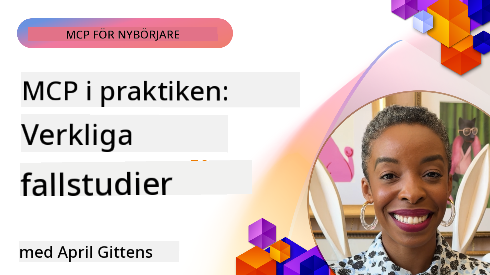

<!--
CO_OP_TRANSLATOR_METADATA:
{
  "original_hash": "61a160248efabe92b09d7b08293d17db",
  "translation_date": "2025-08-18T14:42:59+00:00",
  "source_file": "09-CaseStudy/README.md",
  "language_code": "sv"
}
-->
# MCP i praktiken: Fallstudier från verkligheten

_(Klicka på bilden ovan för att se videon för denna lektion)_

Model Context Protocol (MCP) förändrar hur AI-applikationer interagerar med data, verktyg och tjänster. Denna sektion presenterar fallstudier från verkligheten som visar praktiska tillämpningar av MCP i olika företagsmiljöer.

## Översikt

Denna sektion visar konkreta exempel på MCP-implementeringar och belyser hur organisationer använder detta protokoll för att lösa komplexa affärsutmaningar. Genom att studera dessa fallstudier får du insikter i MCP:s mångsidighet, skalbarhet och praktiska fördelar i verkliga scenarier.

## Viktiga lärandemål

Genom att utforska dessa fallstudier kommer du att:

- Förstå hur MCP kan användas för att lösa specifika affärsproblem
- Lära dig om olika integrationsmönster och arkitektoniska tillvägagångssätt
- Identifiera bästa praxis för att implementera MCP i företagsmiljöer
- Få insikter i utmaningar och lösningar som uppstått vid verkliga implementeringar
- Upptäcka möjligheter att tillämpa liknande mönster i dina egna projekt

## Utvalda fallstudier

### 1. [Azure AI Travel Agents – Referensimplementering](./travelagentsample.md)

Denna fallstudie undersöker Microsofts omfattande referenslösning som visar hur man bygger en AI-driven reseplaneringsapplikation med flera agenter, MCP, Azure OpenAI och Azure AI Search. Projektet visar:

- Orkestrering av flera agenter med MCP
- Integration av företagsdata med Azure AI Search
- Säker och skalbar arkitektur med Azure-tjänster
- Utbyggbara verktyg med återanvändbara MCP-komponenter
- Konversationsbaserad användarupplevelse med Azure OpenAI

Arkitekturen och implementeringsdetaljerna ger värdefulla insikter i hur man bygger komplexa system med flera agenter där MCP fungerar som koordineringslager.

### 2. [Uppdatera Azure DevOps-objekt med YouTube-data](./UpdateADOItemsFromYT.md)

Denna fallstudie visar en praktisk tillämpning av MCP för att automatisera arbetsflöden. Den demonstrerar hur MCP-verktyg kan användas för att:

- Extrahera data från onlineplattformar (YouTube)
- Uppdatera arbetsobjekt i Azure DevOps-system
- Skapa återanvändbara automatiseringsarbetsflöden
- Integrera data mellan olika system

Exemplet illustrerar hur även relativt enkla MCP-implementeringar kan ge betydande effektivitetsvinster genom att automatisera rutinuppgifter och förbättra datakonsistens mellan system.

### 3. [Dokumentationshämtning i realtid med MCP](./docs-mcp/README.md)

Denna fallstudie guidar dig genom att ansluta en Python-konsolklient till en Model Context Protocol (MCP)-server för att hämta och logga realtidsanpassad Microsoft-dokumentation. Du kommer att lära dig hur man:

- Ansluter till en MCP-server med en Python-klient och den officiella MCP SDK
- Använder strömmande HTTP-klienter för effektiv datahämtning i realtid
- Anropar dokumentationsverktyg på servern och loggar svar direkt till konsolen
- Integrerar uppdaterad Microsoft-dokumentation i ditt arbetsflöde utan att lämna terminalen

Kapitlet inkluderar en praktisk uppgift, ett minimalt fungerande kodexempel och länkar till ytterligare resurser för fördjupad inlärning. Se den fullständiga genomgången och koden i det länkade kapitlet för att förstå hur MCP kan förändra åtkomst till dokumentation och utvecklarproduktivitet i konsolbaserade miljöer.

### 4. [Interaktiv studieplansgenerator som webbapp med MCP](./docs-mcp/README.md)

Denna fallstudie visar hur man bygger en interaktiv webbapplikation med Chainlit och Model Context Protocol (MCP) för att generera personliga studieplaner för valfritt ämne. Användare kan ange ett ämne (t.ex. "AI-900 certifiering") och en studietid (t.ex. 8 veckor), och appen kommer att ge en veckovis uppdelning av rekommenderat innehåll. Chainlit möjliggör en konversationsbaserad chattgränssnitt, vilket gör upplevelsen engagerande och anpassningsbar.

- Konversationsbaserad webbapp med Chainlit
- Användardrivna frågor för ämne och tidsram
- Veckovis innehållsrekommendationer med MCP
- Realtidsanpassade svar i ett chattgränssnitt

Projektet illustrerar hur konversationsbaserad AI och MCP kan kombineras för att skapa dynamiska, användardrivna utbildningsverktyg i en modern webbmiljö.

### 5. [Dokumentation i redigeraren med MCP-server i VS Code](./docs-mcp/README.md)

Denna fallstudie visar hur du kan få Microsoft Learn-dokumentation direkt i din VS Code-miljö med MCP-servern – ingen mer växling mellan webbläsarflikar! Du kommer att se hur man:

- Söker och läser dokumentation direkt i VS Code med MCP-panelen eller kommandopaletten
- Refererar dokumentation och infogar länkar direkt i dina README- eller kursmarkdownfiler
- Använder GitHub Copilot och MCP tillsammans för sömlösa, AI-drivna dokumentations- och kodarbetsflöden
- Validerar och förbättrar din dokumentation med realtidsfeedback och Microsoft-källad noggrannhet
- Integrerar MCP med GitHub-arbetsflöden för kontinuerlig dokumentationsvalidering

Implementeringen inkluderar:

- Exempel på `.vscode/mcp.json`-konfiguration för enkel installation
- Genomgångar med skärmdumpar av redigerarupplevelsen
- Tips för att kombinera Copilot och MCP för maximal produktivitet

Detta scenario är idealiskt för kursförfattare, dokumentationsskrivare och utvecklare som vill hålla fokus i sin redigerare medan de arbetar med dokumentation, Copilot och valideringsverktyg – allt drivet av MCP.

### 6. [Skapa MCP-server med APIM](./apimsample.md)

Denna fallstudie ger en steg-för-steg-guide för hur man skapar en MCP-server med Azure API Management (APIM). Den täcker:

- Installation av en MCP-server i Azure API Management
- Exponering av API-operationer som MCP-verktyg
- Konfigurering av policyer för hastighetsbegränsning och säkerhet
- Testning av MCP-servern med Visual Studio Code och GitHub Copilot

Exemplet illustrerar hur man kan utnyttja Azures kapabiliteter för att skapa en robust MCP-server som kan användas i olika applikationer och förbättra integrationen av AI-system med företags-API:er.

## Slutsats

Dessa fallstudier belyser mångsidigheten och de praktiska tillämpningarna av Model Context Protocol i verkliga scenarier. Från komplexa system med flera agenter till riktade automatiseringsarbetsflöden, MCP erbjuder ett standardiserat sätt att koppla AI-system med de verktyg och data de behöver för att leverera värde.

Genom att studera dessa implementeringar kan du få insikter i arkitektoniska mönster, implementeringsstrategier och bästa praxis som kan tillämpas på dina egna MCP-projekt. Exemplen visar att MCP inte bara är en teoretisk ram utan en praktisk lösning på verkliga affärsutmaningar.

## Ytterligare resurser

- [Azure AI Travel Agents GitHub Repository](https://github.com/Azure-Samples/azure-ai-travel-agents)
- [Azure DevOps MCP Tool](https://github.com/microsoft/azure-devops-mcp)
- [Playwright MCP Tool](https://github.com/microsoft/playwright-mcp)
- [Microsoft Docs MCP Server](https://github.com/MicrosoftDocs/mcp)
- [MCP Community Examples](https://github.com/microsoft/mcp)

Nästa: Praktisk labb [Effektivisera AI-arbetsflöden: Bygga en MCP-server med AI Toolkit](../10-StreamliningAIWorkflowsBuildingAnMCPServerWithAIToolkit/README.md)

**Ansvarsfriskrivning**:  
Detta dokument har översatts med hjälp av AI-översättningstjänsten [Co-op Translator](https://github.com/Azure/co-op-translator). Även om vi strävar efter noggrannhet, vänligen notera att automatiska översättningar kan innehålla fel eller felaktigheter. Det ursprungliga dokumentet på dess originalspråk bör betraktas som den auktoritativa källan. För kritisk information rekommenderas professionell mänsklig översättning. Vi ansvarar inte för eventuella missförstånd eller feltolkningar som uppstår vid användning av denna översättning.