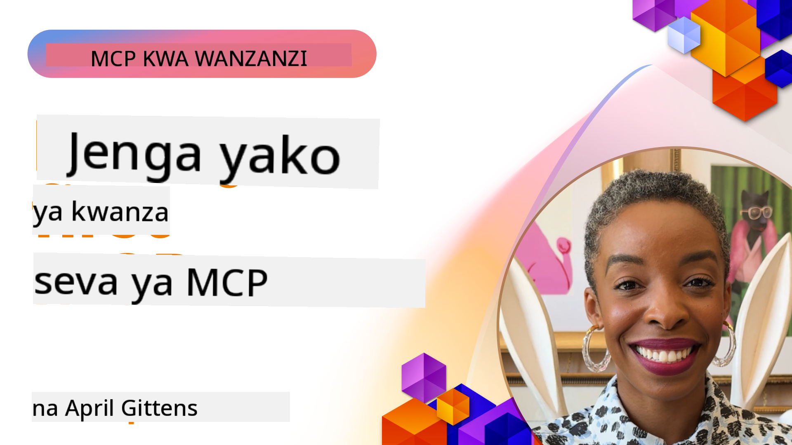

<!--
CO_OP_TRANSLATOR_METADATA:
{
  "original_hash": "1197b6dbde36773e04a5ae826557fdb9",
  "translation_date": "2025-08-26T18:09:25+00:00",
  "source_file": "03-GettingStarted/README.md",
  "language_code": "sw"
}
-->
## Kuanza  

_(Bofya picha hapo juu kutazama video ya somo hili)_

Sehemu hii inajumuisha masomo kadhaa:

- **1 Seva yako ya kwanza**, katika somo hili la kwanza, utajifunza jinsi ya kuunda seva yako ya kwanza na kuitazama kwa kutumia zana ya ukaguzi, njia muhimu ya kujaribu na kurekebisha seva yako, [kwenda kwenye somo](01-first-server/README.md)

- **2 Mteja**, katika somo hili, utajifunza jinsi ya kuandika mteja ambaye anaweza kuunganishwa na seva yako, [kwenda kwenye somo](02-client/README.md)

- **3 Mteja na LLM**, njia bora zaidi ya kuandika mteja ni kwa kuongeza LLM ili iweze "kujadiliana" na seva yako kuhusu nini cha kufanya, [kwenda kwenye somo](03-llm-client/README.md)

- **4 Kutumia Seva ya GitHub Copilot Agent Mode ndani ya Visual Studio Code**. Hapa, tunachunguza jinsi ya kuendesha Seva yetu ya MCP kutoka ndani ya Visual Studio Code, [kwenda kwenye somo](04-vscode/README.md)

- **5 Seva ya Usafirishaji ya stdio**. Usafirishaji wa stdio ni kiwango kilichopendekezwa kwa mawasiliano kati ya seva na mteja wa MCP katika maelezo ya sasa, ikitoa mawasiliano salama kwa kutumia mchakato wa chini, [kwenda kwenye somo](05-stdio-server/README.md)

- **6 Utiririshaji wa HTTP na MCP (Streamable HTTP)**. Jifunze kuhusu utiririshaji wa kisasa wa HTTP, arifa za maendeleo, na jinsi ya kutekeleza seva na wateja wa MCP kwa kutumia Streamable HTTP kwa njia inayoweza kupimika na ya wakati halisi, [kwenda kwenye somo](06-http-streaming/README.md)

- **7 Kutumia AI Toolkit kwa VSCode** ili kutumia na kujaribu Wateja na Seva zako za MCP, [kwenda kwenye somo](07-aitk/README.md)

- **8 Kupima**. Hapa tutazingatia hasa jinsi tunavyoweza kujaribu seva na mteja wetu kwa njia tofauti, [kwenda kwenye somo](08-testing/README.md)

- **9 Utekelezaji**. Sura hii itaangazia njia tofauti za kutekeleza suluhisho zako za MCP, [kwenda kwenye somo](09-deployment/README.md)

Itifaki ya Model Context Protocol (MCP) ni itifaki ya wazi inayosanifisha jinsi programu zinavyotoa muktadha kwa LLMs. Fikiria MCP kama bandari ya USB-C kwa programu za AI - inatoa njia sanifu ya kuunganisha mifano ya AI na vyanzo tofauti vya data na zana.

## Malengo ya Kujifunza

Mwisho wa somo hili, utaweza:

- Kuseti mazingira ya maendeleo kwa MCP katika C#, Java, Python, TypeScript, na JavaScript
- Kujenga na kutekeleza seva za msingi za MCP zenye vipengele maalum (rasilimali, maelekezo, na zana)
- Kuunda programu za mwenyeji zinazounganisha na seva za MCP
- Kupima na kurekebisha utekelezaji wa MCP
- Kuelewa changamoto za kawaida za usanidi na suluhisho zake
- Kuunganisha utekelezaji wako wa MCP na huduma maarufu za LLM

## Kuseti Mazingira Yako ya MCP

Kabla ya kuanza kufanya kazi na MCP, ni muhimu kuandaa mazingira yako ya maendeleo na kuelewa mtiririko wa kazi wa msingi. Sehemu hii itakuongoza kupitia hatua za awali za usanidi ili kuhakikisha unaanza vizuri na MCP.

### Mahitaji ya Awali

Kabla ya kuanza maendeleo ya MCP, hakikisha una:

- **Mazingira ya Maendeleo**: Kwa lugha uliyochagua (C#, Java, Python, TypeScript, au JavaScript)
- **IDE/Mhariri**: Visual Studio, Visual Studio Code, IntelliJ, Eclipse, PyCharm, au mhariri wowote wa kisasa wa msimbo
- **Wasimamizi wa Vifurushi**: NuGet, Maven/Gradle, pip, au npm/yarn
- **Vifunguo vya API**: Kwa huduma zozote za AI unazopanga kutumia katika programu zako za mwenyeji

### SDK Rasmi

Katika sura zijazo utaona suluhisho zilizojengwa kwa kutumia Python, TypeScript, Java, na .NET. Hapa kuna SDK zote zinazoungwa mkono rasmi.

MCP inatoa SDK rasmi kwa lugha nyingi:
- [C# SDK](https://github.com/modelcontextprotocol/csharp-sdk) - Inadumishwa kwa kushirikiana na Microsoft
- [Java SDK](https://github.com/modelcontextprotocol/java-sdk) - Inadumishwa kwa kushirikiana na Spring AI
- [TypeScript SDK](https://github.com/modelcontextprotocol/typescript-sdk) - Utekelezaji rasmi wa TypeScript
- [Python SDK](https://github.com/modelcontextprotocol/python-sdk) - Utekelezaji rasmi wa Python
- [Kotlin SDK](https://github.com/modelcontextprotocol/kotlin-sdk) - Utekelezaji rasmi wa Kotlin
- [Swift SDK](https://github.com/modelcontextprotocol/swift-sdk) - Inadumishwa kwa kushirikiana na Loopwork AI
- [Rust SDK](https://github.com/modelcontextprotocol/rust-sdk) - Utekelezaji rasmi wa Rust

## Mambo Muhimu ya Kukumbuka

- Kuseti mazingira ya maendeleo ya MCP ni rahisi kwa kutumia SDK maalum za lugha
- Kujenga seva za MCP kunahusisha kuunda na kusajili zana zenye miundo wazi
- Wateja wa MCP huunganisha na seva na mifano ili kutumia uwezo wa ziada
- Kupima na kurekebisha ni muhimu kwa utekelezaji wa MCP wa kuaminika
- Chaguo za utekelezaji zinatoka kwa maendeleo ya ndani hadi suluhisho za msingi wa wingu

## Mazoezi

Tuna seti ya sampuli zinazosaidia mazoezi utakayoyaona katika sura zote za sehemu hii. Zaidi ya hayo, kila sura pia ina mazoezi na kazi zake.

- [Kikokotoo cha Java](./samples/java/calculator/README.md)
- [Kikokotoo cha .Net](../../../03-GettingStarted/samples/csharp)
- [Kikokotoo cha JavaScript](./samples/javascript/README.md)
- [Kikokotoo cha TypeScript](./samples/typescript/README.md)
- [Kikokotoo cha Python](../../../03-GettingStarted/samples/python)

## Rasilimali za Ziada

- [Jenga Mawakala kwa kutumia Model Context Protocol kwenye Azure](https://learn.microsoft.com/azure/developer/ai/intro-agents-mcp)
- [MCP ya Mbali na Azure Container Apps (Node.js/TypeScript/JavaScript)](https://learn.microsoft.com/samples/azure-samples/mcp-container-ts/mcp-container-ts/)
- [.NET OpenAI MCP Agent](https://learn.microsoft.com/samples/azure-samples/openai-mcp-agent-dotnet/openai-mcp-agent-dotnet/)

## Nini Kifuatacho

Ifuatayo: [Kuunda Seva yako ya Kwanza ya MCP](01-first-server/README.md)

---

**Kanusho**:  
Hati hii imetafsiriwa kwa kutumia huduma ya kutafsiri ya AI [Co-op Translator](https://github.com/Azure/co-op-translator). Ingawa tunajitahidi kuhakikisha usahihi, tafadhali fahamu kuwa tafsiri za kiotomatiki zinaweza kuwa na makosa au kutokuwa sahihi. Hati ya asili katika lugha yake ya awali inapaswa kuzingatiwa kama chanzo cha mamlaka. Kwa taarifa muhimu, tafsiri ya kitaalamu ya binadamu inapendekezwa. Hatutawajibika kwa kutoelewana au tafsiri zisizo sahihi zinazotokana na matumizi ya tafsiri hii.