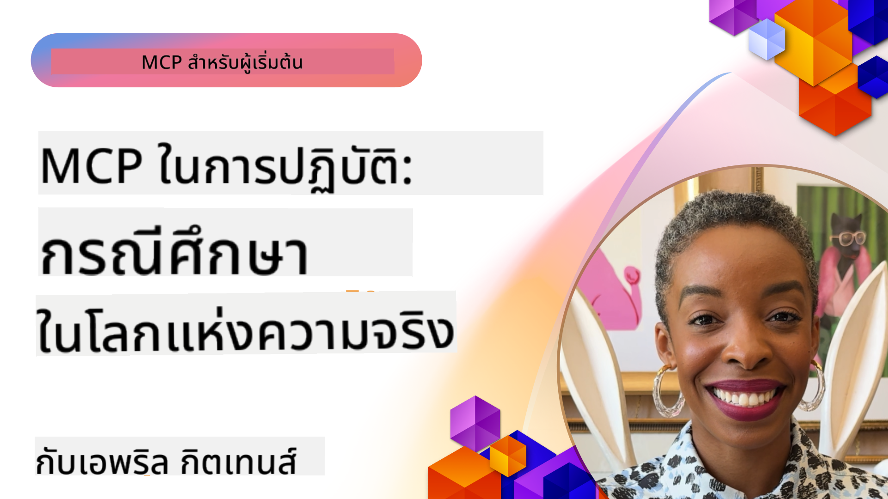

<!--
CO_OP_TRANSLATOR_METADATA:
{
  "original_hash": "61a160248efabe92b09d7b08293d17db",
  "translation_date": "2025-08-18T14:09:22+00:00",
  "source_file": "09-CaseStudy/README.md",
  "language_code": "th"
}
-->
# MCP ในการใช้งาน: กรณีศึกษาในโลกจริง

_(คลิกที่ภาพด้านบนเพื่อดูวิดีโอของบทเรียนนี้)_

Model Context Protocol (MCP) กำลังเปลี่ยนแปลงวิธีที่แอปพลิเคชัน AI โต้ตอบกับข้อมูล เครื่องมือ และบริการ ส่วนนี้นำเสนอกรณีศึกษาในโลกจริงที่แสดงการใช้งาน MCP ในสถานการณ์องค์กรต่างๆ

## ภาพรวม

ส่วนนี้นำเสนอตัวอย่างที่ชัดเจนของการใช้งาน MCP โดยเน้นให้เห็นว่าองค์กรต่างๆ ใช้โปรโตคอลนี้เพื่อแก้ไขปัญหาทางธุรกิจที่ซับซ้อนอย่างไร การศึกษากรณีเหล่านี้จะช่วยให้คุณเข้าใจถึงความหลากหลาย ความสามารถในการขยาย และประโยชน์ที่เป็นรูปธรรมของ MCP ในสถานการณ์จริง

## วัตถุประสงค์การเรียนรู้ที่สำคัญ

จากการศึกษากรณีเหล่านี้ คุณจะ:

- เข้าใจว่า MCP สามารถนำไปใช้แก้ปัญหาธุรกิจเฉพาะได้อย่างไร
- เรียนรู้เกี่ยวกับรูปแบบการผสานรวมและแนวทางสถาปัตยกรรมที่แตกต่างกัน
- รับรู้แนวปฏิบัติที่ดีที่สุดสำหรับการใช้งาน MCP ในสภาพแวดล้อมองค์กร
- ได้รับข้อมูลเชิงลึกเกี่ยวกับความท้าทายและวิธีแก้ไขที่พบในกรณีการใช้งานจริง
- ระบุโอกาสในการนำรูปแบบที่คล้ายกันไปใช้ในโครงการของคุณเอง

## กรณีศึกษาที่โดดเด่น

### 1. [Azure AI Travel Agents – การใช้งานอ้างอิง](./travelagentsample.md)

กรณีศึกษานี้ตรวจสอบโซลูชันอ้างอิงที่ครอบคลุมของ Microsoft ซึ่งแสดงวิธีสร้างแอปพลิเคชันวางแผนการเดินทางที่ขับเคลื่อนด้วย AI แบบหลายตัวแทนโดยใช้ MCP, Azure OpenAI และ Azure AI Search โครงการนี้แสดงให้เห็น:

- การจัดการตัวแทนหลายตัวผ่าน MCP
- การผสานรวมข้อมูลองค์กรด้วย Azure AI Search
- สถาปัตยกรรมที่ปลอดภัยและขยายได้โดยใช้บริการ Azure
- เครื่องมือที่สามารถขยายได้ด้วยส่วนประกอบ MCP ที่นำกลับมาใช้ใหม่ได้
- ประสบการณ์ผู้ใช้แบบสนทนาที่ขับเคลื่อนด้วย Azure OpenAI

รายละเอียดสถาปัตยกรรมและการใช้งานให้ข้อมูลเชิงลึกที่มีค่าเกี่ยวกับการสร้างระบบหลายตัวแทนที่ซับซ้อนโดยมี MCP เป็นชั้นการประสานงาน

### 2. [การอัปเดตรายการ Azure DevOps จากข้อมูล YouTube](./UpdateADOItemsFromYT.md)

กรณีศึกษานี้แสดงการใช้งาน MCP ในการทำงานอัตโนมัติของกระบวนการทำงาน โดยแสดงให้เห็นว่าเครื่องมือ MCP สามารถใช้เพื่อ:

- ดึงข้อมูลจากแพลตฟอร์มออนไลน์ (YouTube)
- อัปเดตรายการงานในระบบ Azure DevOps
- สร้างกระบวนการทำงานอัตโนมัติที่ทำซ้ำได้
- ผสานรวมข้อมูลระหว่างระบบที่แตกต่างกัน

ตัวอย่างนี้แสดงให้เห็นว่าแม้การใช้งาน MCP ที่ค่อนข้างเรียบง่ายก็สามารถเพิ่มประสิทธิภาพได้อย่างมากโดยการทำงานที่เป็นกิจวัตรให้เป็นอัตโนมัติและปรับปรุงความสอดคล้องของข้อมูลระหว่างระบบ

### 3. [การดึงเอกสารแบบเรียลไทม์ด้วย MCP](./docs-mcp/README.md)

กรณีศึกษานี้แนะนำวิธีการเชื่อมต่อไคลเอนต์คอนโซล Python กับเซิร์ฟเวอร์ Model Context Protocol (MCP) เพื่อดึงและบันทึกเอกสาร Microsoft ที่มีบริบทแบบเรียลไทม์ คุณจะได้เรียนรู้วิธี:

- เชื่อมต่อกับเซิร์ฟเวอร์ MCP โดยใช้ไคลเอนต์ Python และ MCP SDK อย่างเป็นทางการ
- ใช้ไคลเอนต์ HTTP แบบสตรีมเพื่อดึงข้อมูลแบบเรียลไทม์อย่างมีประสิทธิภาพ
- เรียกใช้เครื่องมือเอกสารบนเซิร์ฟเวอร์และบันทึกการตอบกลับโดยตรงไปยังคอนโซล
- ผสานรวมเอกสาร Microsoft ที่ทันสมัยเข้ากับกระบวนการทำงานของคุณโดยไม่ต้องออกจากเทอร์มินัล

บทนี้รวมถึงการมอบหมายงานแบบลงมือทำ ตัวอย่างโค้ดที่ใช้งานได้ขั้นต่ำ และลิงก์ไปยังแหล่งข้อมูลเพิ่มเติมเพื่อการเรียนรู้ที่ลึกซึ้งยิ่งขึ้น ดูคำแนะนำแบบเต็มและโค้ดในบทที่เชื่อมโยงเพื่อทำความเข้าใจว่า MCP สามารถเปลี่ยนแปลงการเข้าถึงเอกสารและประสิทธิภาพของนักพัฒนาในสภาพแวดล้อมที่ใช้คอนโซลได้อย่างไร

### 4. [แอปเว็บสร้างแผนการเรียนแบบโต้ตอบด้วย MCP](./docs-mcp/README.md)

กรณีศึกษานี้แสดงวิธีสร้างแอปพลิเคชันเว็บแบบโต้ตอบโดยใช้ Chainlit และ Model Context Protocol (MCP) เพื่อสร้างแผนการเรียนส่วนบุคคลสำหรับหัวข้อใดๆ ผู้ใช้สามารถระบุหัวข้อ (เช่น "การรับรอง AI-900") และระยะเวลาเรียน (เช่น 8 สัปดาห์) และแอปจะให้รายละเอียดเนื้อหาแนะนำแบบสัปดาห์ต่อสัปดาห์ Chainlit ช่วยให้มีอินเทอร์เฟซการสนทนาแบบแชท ทำให้ประสบการณ์มีความน่าสนใจและปรับเปลี่ยนได้

- แอปเว็บสนทนาที่ขับเคลื่อนด้วย Chainlit
- คำแนะนำที่ขับเคลื่อนโดยผู้ใช้สำหรับหัวข้อและระยะเวลา
- คำแนะนำเนื้อหาแบบสัปดาห์ต่อสัปดาห์โดยใช้ MCP
- การตอบสนองแบบเรียลไทม์และปรับเปลี่ยนได้ในอินเทอร์เฟซแชท

โครงการนี้แสดงให้เห็นว่า AI สนทนาและ MCP สามารถรวมกันเพื่อสร้างเครื่องมือการศึกษาที่มีความยืดหยุ่นและขับเคลื่อนโดยผู้ใช้ในสภาพแวดล้อมเว็บสมัยใหม่ได้อย่างไร

### 5. [เอกสารในตัวแก้ไขด้วยเซิร์ฟเวอร์ MCP ใน VS Code](./docs-mcp/README.md)

กรณีศึกษานี้แสดงวิธีนำเอกสาร Microsoft Learn Docs เข้าสู่สภาพแวดล้อม VS Code ของคุณโดยตรงโดยใช้เซิร์ฟเวอร์ MCP—ไม่ต้องสลับแท็บเบราว์เซอร์อีกต่อไป! คุณจะเห็นวิธี:

- ค้นหาและอ่านเอกสารทันทีใน VS Code โดยใช้แผง MCP หรือคำสั่งใน Command Palette
- อ้างอิงเอกสารและแทรกลิงก์โดยตรงในไฟล์ README หรือ Markdown หลักสูตรของคุณ
- ใช้ GitHub Copilot และ MCP ร่วมกันเพื่อการทำงานเอกสารและโค้ดที่ขับเคลื่อนด้วย AI อย่างไร้รอยต่อ
- ตรวจสอบและปรับปรุงเอกสารของคุณด้วยความคิดเห็นแบบเรียลไทม์และความถูกต้องที่มาจาก Microsoft
- ผสานรวม MCP กับเวิร์กโฟลว์ GitHub เพื่อการตรวจสอบเอกสารอย่างต่อเนื่อง

การใช้งานรวมถึง:

- ตัวอย่างการตั้งค่า `.vscode/mcp.json` ที่ง่ายดาย
- คำแนะนำแบบภาพหน้าจอของประสบการณ์ในตัวแก้ไข
- เคล็ดลับสำหรับการรวม Copilot และ MCP เพื่อเพิ่มประสิทธิภาพสูงสุด

สถานการณ์นี้เหมาะสำหรับผู้เขียนหลักสูตร นักเขียนเอกสาร และนักพัฒนาที่ต้องการมุ่งเน้นในตัวแก้ไขขณะทำงานกับเอกสาร Copilot และเครื่องมือการตรวจสอบ—ทั้งหมดนี้ขับเคลื่อนด้วย MCP

### 6. [การสร้างเซิร์ฟเวอร์ MCP ด้วย APIM](./apimsample.md)

กรณีศึกษานี้ให้คำแนะนำทีละขั้นตอนเกี่ยวกับวิธีสร้างเซิร์ฟเวอร์ MCP โดยใช้ Azure API Management (APIM) ครอบคลุม:

- การตั้งค่าเซิร์ฟเวอร์ MCP ใน Azure API Management
- การเปิดเผยการดำเนินการ API เป็นเครื่องมือ MCP
- การกำหนดนโยบายสำหรับการจำกัดอัตราและความปลอดภัย
- การทดสอบเซิร์ฟเวอร์ MCP โดยใช้ Visual Studio Code และ GitHub Copilot

ตัวอย่างนี้แสดงให้เห็นวิธีใช้ความสามารถของ Azure เพื่อสร้างเซิร์ฟเวอร์ MCP ที่แข็งแกร่งซึ่งสามารถใช้ในแอปพลิเคชันต่างๆ เพื่อเพิ่มการผสานรวมระบบ AI กับ API ขององค์กร

## สรุป

กรณีศึกษาเหล่านี้เน้นให้เห็นถึงความหลากหลายและการใช้งานจริงของ Model Context Protocol ในสถานการณ์จริง ตั้งแต่ระบบหลายตัวแทนที่ซับซ้อนไปจนถึงกระบวนการทำงานอัตโนมัติที่มุ่งเน้น MCP ให้วิธีการมาตรฐานในการเชื่อมต่อระบบ AI กับเครื่องมือและข้อมูลที่จำเป็นเพื่อสร้างคุณค่า

จากการศึกษาการใช้งานเหล่านี้ คุณสามารถรับข้อมูลเชิงลึกเกี่ยวกับรูปแบบสถาปัตยกรรม กลยุทธ์การใช้งาน และแนวปฏิบัติที่ดีที่สุดที่สามารถนำไปใช้กับโครงการ MCP ของคุณเอง ตัวอย่างเหล่านี้แสดงให้เห็นว่า MCP ไม่ใช่แค่กรอบแนวคิด แต่เป็นโซลูชันที่ใช้งานได้จริงสำหรับความท้าทายทางธุรกิจในโลกจริง

## แหล่งข้อมูลเพิ่มเติม

- [Azure AI Travel Agents GitHub Repository](https://github.com/Azure-Samples/azure-ai-travel-agents)
- [Azure DevOps MCP Tool](https://github.com/microsoft/azure-devops-mcp)
- [Playwright MCP Tool](https://github.com/microsoft/playwright-mcp)
- [Microsoft Docs MCP Server](https://github.com/MicrosoftDocs/mcp)
- [MCP Community Examples](https://github.com/microsoft/mcp)

ถัดไป: ห้องปฏิบัติการ [การปรับปรุงเวิร์กโฟลว์ AI: การสร้างเซิร์ฟเวอร์ MCP ด้วย AI Toolkit](../10-StreamliningAIWorkflowsBuildingAnMCPServerWithAIToolkit/README.md)

**ข้อจำกัดความรับผิดชอบ**:  
เอกสารนี้ได้รับการแปลโดยใช้บริการแปลภาษา AI [Co-op Translator](https://github.com/Azure/co-op-translator) แม้ว่าเราจะพยายามให้การแปลมีความถูกต้อง แต่โปรดทราบว่าการแปลอัตโนมัติอาจมีข้อผิดพลาดหรือความไม่แม่นยำ เอกสารต้นฉบับในภาษาต้นทางควรถือเป็นแหล่งข้อมูลที่เชื่อถือได้ สำหรับข้อมูลที่สำคัญ ขอแนะนำให้ใช้บริการแปลภาษามนุษย์ที่เป็นมืออาชีพ เราจะไม่รับผิดชอบต่อความเข้าใจผิดหรือการตีความที่ผิดพลาดซึ่งเกิดจากการใช้การแปลนี้