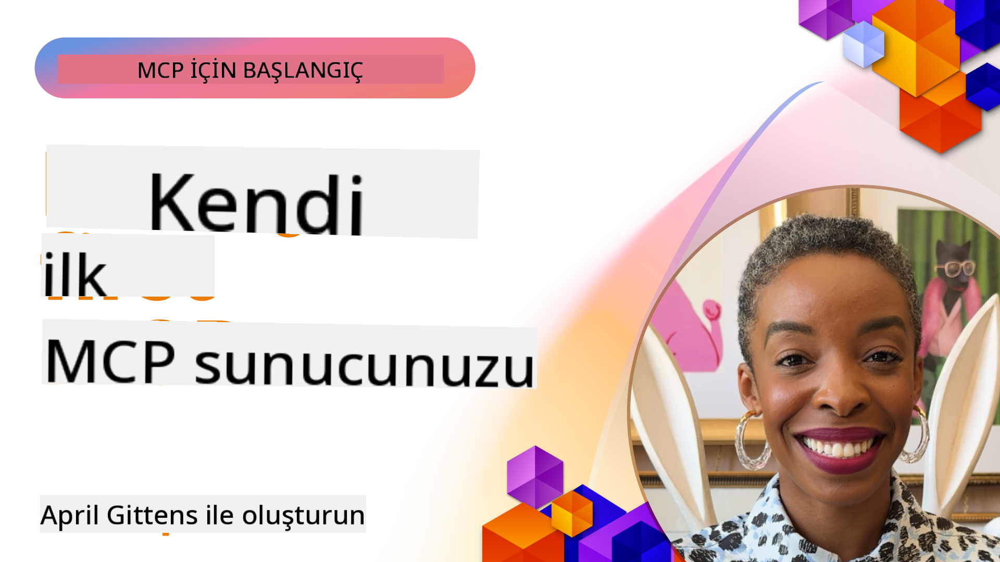

<!--
CO_OP_TRANSLATOR_METADATA:
{
  "original_hash": "1197b6dbde36773e04a5ae826557fdb9",
  "translation_date": "2025-08-26T17:43:47+00:00",
  "source_file": "03-GettingStarted/README.md",
  "language_code": "tr"
}
-->
## Başlarken  

_(Bu dersin videosunu izlemek için yukarıdaki görsele tıklayın)_

Bu bölüm birkaç dersten oluşmaktadır:

- **1 İlk sunucunuz**, bu ilk derste, ilk sunucunuzu nasıl oluşturacağınızı ve bunu test etmek ve hata ayıklamak için değerli bir araç olan denetleyici aracıyla nasıl inceleyeceğinizi öğreneceksiniz, [derse git](01-first-server/README.md)

- **2 İstemci**, bu derste, sunucunuza bağlanabilecek bir istemci yazmayı öğreneceksiniz, [derse git](02-client/README.md)

- **3 LLM ile İstemci**, bir istemci yazmanın daha iyi bir yolu, ona bir LLM eklemek ve böylece sunucunuzla ne yapması gerektiği konusunda "müzakere" edebilmesini sağlamaktır, [derse git](03-llm-client/README.md)

- **4 Visual Studio Code'da GitHub Copilot Agent modunda bir sunucu çalıştırma**. Burada, MCP Sunucumuzu Visual Studio Code içinde çalıştırmayı ele alıyoruz, [derse git](04-vscode/README.md)

- **5 stdio Taşıma Sunucusu** stdio taşıma, mevcut spesifikasyonda MCP sunucu-istemci iletişimi için önerilen standarttır ve güvenli alt işlem tabanlı iletişim sağlar, [derse git](05-stdio-server/README.md)

- **6 MCP ile HTTP Akışı (Akışlı HTTP)**. Modern HTTP akışı, ilerleme bildirimleri ve Akışlı HTTP kullanarak ölçeklenebilir, gerçek zamanlı MCP sunucuları ve istemcileri nasıl uygulayacağınızı öğrenin, [derse git](06-http-streaming/README.md)

- **7 VSCode için AI Araç Setini Kullanma** MCP İstemcilerinizi ve Sunucularınızı tüketmek ve test etmek için [derse git](07-aitk/README.md)

- **8 Test Etme**. Burada özellikle sunucumuzu ve istemcimizi farklı şekillerde nasıl test edebileceğimize odaklanacağız, [derse git](08-testing/README.md)

- **9 Dağıtım**. Bu bölümde MCP çözümlerinizi dağıtmanın farklı yollarını inceleyeceğiz, [derse git](09-deployment/README.md)

Model Context Protocol (MCP), uygulamaların LLM'lere bağlam sağlamasını standartlaştıran açık bir protokoldür. MCP'yi, AI uygulamaları için bir USB-C portu gibi düşünebilirsiniz - AI modellerini farklı veri kaynaklarına ve araçlara bağlamak için standart bir yol sağlar.

## Öğrenme Hedefleri

Bu dersin sonunda şunları yapabileceksiniz:

- MCP için C#, Java, Python, TypeScript ve JavaScript'te geliştirme ortamlarını kurmak
- Özel özelliklere (kaynaklar, istemler ve araçlar) sahip temel MCP sunucuları oluşturmak ve dağıtmak
- MCP sunucularına bağlanan ana uygulamalar oluşturmak
- MCP uygulamalarını test etmek ve hata ayıklamak
- Yaygın kurulum zorluklarını ve çözümlerini anlamak
- MCP uygulamalarınızı popüler LLM hizmetlerine bağlamak

## MCP Ortamınızı Kurma

MCP ile çalışmaya başlamadan önce, geliştirme ortamınızı hazırlamanız ve temel iş akışını anlamanız önemlidir. Bu bölüm, MCP ile sorunsuz bir başlangıç için gerekli olan ilk kurulum adımlarında size rehberlik edecektir.

### Ön Koşullar

MCP geliştirmesine başlamadan önce, aşağıdakilere sahip olduğunuzdan emin olun:

- **Geliştirme Ortamı**: Seçtiğiniz dil için (C#, Java, Python, TypeScript veya JavaScript)
- **IDE/Düzenleyici**: Visual Studio, Visual Studio Code, IntelliJ, Eclipse, PyCharm veya herhangi bir modern kod düzenleyici
- **Paket Yöneticileri**: NuGet, Maven/Gradle, pip veya npm/yarn
- **API Anahtarları**: Ana uygulamalarınızda kullanmayı planladığınız AI hizmetleri için

### Resmi SDK'lar

Gelecek bölümlerde Python, TypeScript, Java ve .NET kullanılarak oluşturulmuş çözümler göreceksiniz. İşte resmi olarak desteklenen tüm SDK'lar.

MCP, birden fazla dil için resmi SDK'lar sağlar:
- [C# SDK](https://github.com/modelcontextprotocol/csharp-sdk) - Microsoft ile iş birliği içinde sürdürülmektedir
- [Java SDK](https://github.com/modelcontextprotocol/java-sdk) - Spring AI ile iş birliği içinde sürdürülmektedir
- [TypeScript SDK](https://github.com/modelcontextprotocol/typescript-sdk) - Resmi TypeScript uygulaması
- [Python SDK](https://github.com/modelcontextprotocol/python-sdk) - Resmi Python uygulaması
- [Kotlin SDK](https://github.com/modelcontextprotocol/kotlin-sdk) - Resmi Kotlin uygulaması
- [Swift SDK](https://github.com/modelcontextprotocol/swift-sdk) - Loopwork AI ile iş birliği içinde sürdürülmektedir
- [Rust SDK](https://github.com/modelcontextprotocol/rust-sdk) - Resmi Rust uygulaması

## Temel Çıkarımlar

- MCP geliştirme ortamını kurmak, dil spesifik SDK'larla oldukça basittir
- MCP sunucuları oluşturmak, net şemalarla araçlar oluşturmayı ve kaydetmeyi içerir
- MCP istemcileri, genişletilmiş yeteneklerden yararlanmak için sunuculara ve modellere bağlanır
- Güvenilir MCP uygulamaları için test ve hata ayıklama esastır
- Dağıtım seçenekleri, yerel geliştirmeden bulut tabanlı çözümlere kadar çeşitlilik gösterir

## Uygulama

Bu bölümdeki tüm derslerde göreceğiniz alıştırmaları tamamlayan bir dizi örneğimiz var. Ayrıca her bölümün kendi alıştırmaları ve ödevleri de bulunmaktadır.

- [Java Hesap Makinesi](./samples/java/calculator/README.md)
- [.Net Hesap Makinesi](../../../03-GettingStarted/samples/csharp)
- [JavaScript Hesap Makinesi](./samples/javascript/README.md)
- [TypeScript Hesap Makinesi](./samples/typescript/README.md)
- [Python Hesap Makinesi](../../../03-GettingStarted/samples/python)

## Ek Kaynaklar

- [Azure'da Model Context Protocol Kullanarak Agentler Oluşturma](https://learn.microsoft.com/azure/developer/ai/intro-agents-mcp)
- [Azure Container Apps ile Uzaktan MCP (Node.js/TypeScript/JavaScript)](https://learn.microsoft.com/samples/azure-samples/mcp-container-ts/mcp-container-ts/)
- [.NET OpenAI MCP Agent](https://learn.microsoft.com/samples/azure-samples/openai-mcp-agent-dotnet/openai-mcp-agent-dotnet/)

## Sıradaki Adım

Sonraki: [İlk MCP Sunucunuzu Oluşturma](01-first-server/README.md)

---

**Feragatname**:  
Bu belge, AI çeviri hizmeti [Co-op Translator](https://github.com/Azure/co-op-translator) kullanılarak çevrilmiştir. Doğruluk için çaba göstersek de, otomatik çevirilerin hata veya yanlışlıklar içerebileceğini lütfen unutmayın. Belgenin orijinal dili, yetkili kaynak olarak kabul edilmelidir. Kritik bilgiler için profesyonel insan çevirisi önerilir. Bu çevirinin kullanımından kaynaklanan yanlış anlamalar veya yanlış yorumlamalar için sorumluluk kabul edilmemektedir.