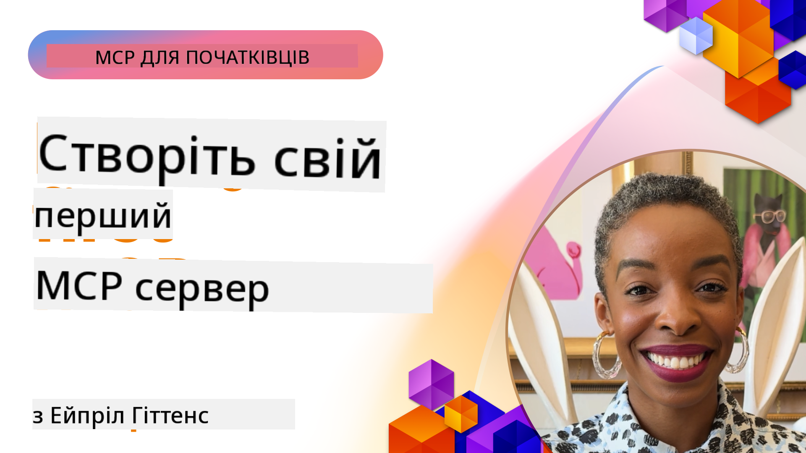

<!--
CO_OP_TRANSLATOR_METADATA:
{
  "original_hash": "1197b6dbde36773e04a5ae826557fdb9",
  "translation_date": "2025-08-26T18:29:55+00:00",
  "source_file": "03-GettingStarted/README.md",
  "language_code": "uk"
}
-->
## Початок роботи  

_(Натисніть на зображення вище, щоб переглянути відео цього уроку)_

Цей розділ складається з кількох уроків:

- **1 Ваш перший сервер**. У цьому першому уроці ви навчитеся створювати свій перший сервер і перевіряти його за допомогою інструменту інспектора — корисного способу тестування та налагодження вашого сервера, [до уроку](01-first-server/README.md)

- **2 Клієнт**. У цьому уроці ви навчитеся писати клієнт, який може підключатися до вашого сервера, [до уроку](02-client/README.md)

- **3 Клієнт з LLM**. Ще кращий спосіб написання клієнта — додати до нього LLM, щоб він міг "узгоджувати" з вашим сервером, що робити, [до уроку](03-llm-client/README.md)

- **4 Використання сервера в режимі GitHub Copilot Agent у Visual Studio Code**. Тут ми розглянемо запуск нашого MCP сервера безпосередньо у Visual Studio Code, [до уроку](04-vscode/README.md)

- **5 Сервер транспорту stdio**. Транспорт stdio є рекомендованим стандартом для комунікації між MCP сервером і клієнтом у поточній специфікації, забезпечуючи безпечну комунікацію на основі підпроцесів, [до уроку](05-stdio-server/README.md)

- **6 HTTP стрімінг з MCP (Streamable HTTP)**. Дізнайтеся про сучасний HTTP стрімінг, сповіщення про прогрес і як реалізувати масштабовані MCP сервери та клієнти в реальному часі за допомогою Streamable HTTP, [до уроку](06-http-streaming/README.md)

- **7 Використання AI Toolkit для VSCode** для тестування ваших MCP клієнтів і серверів, [до уроку](07-aitk/README.md)

- **8 Тестування**. Тут ми зосередимося на різних способах тестування вашого сервера та клієнта, [до уроку](08-testing/README.md)

- **9 Розгортання**. У цьому розділі ми розглянемо різні способи розгортання ваших MCP рішень, [до уроку](09-deployment/README.md)

Протокол контексту моделі (MCP) — це відкритий протокол, який стандартизує спосіб надання контексту LLM додатками. Уявіть MCP як порт USB-C для AI додатків — він забезпечує стандартизований спосіб підключення AI моделей до різних джерел даних і інструментів.

## Цілі навчання

До кінця цього уроку ви зможете:

- Налаштувати середовище розробки для MCP у C#, Java, Python, TypeScript і JavaScript
- Створювати та розгортати базові MCP сервери з кастомними функціями (ресурси, підказки та інструменти)
- Створювати хост-додатки, які підключаються до MCP серверів
- Тестувати та налагоджувати реалізації MCP
- Розуміти поширені проблеми налаштування та їх вирішення
- Підключати ваші реалізації MCP до популярних LLM сервісів

## Налаштування середовища MCP

Перед тим як почати працювати з MCP, важливо підготувати середовище розробки та зрозуміти основний робочий процес. Цей розділ проведе вас через початкові кроки налаштування, щоб забезпечити плавний старт з MCP.

### Попередні вимоги

Перед початком розробки MCP переконайтеся, що у вас є:

- **Середовище розробки**: Для обраної вами мови (C#, Java, Python, TypeScript або JavaScript)
- **IDE/Редактор**: Visual Studio, Visual Studio Code, IntelliJ, Eclipse, PyCharm або будь-який сучасний редактор коду
- **Менеджери пакетів**: NuGet, Maven/Gradle, pip або npm/yarn
- **API ключі**: Для будь-яких AI сервісів, які ви плануєте використовувати у ваших хост-додатках

### Офіційні SDK

У наступних розділах ви побачите рішення, створені за допомогою Python, TypeScript, Java та .NET. Ось усі офіційно підтримувані SDK.

MCP надає офіційні SDK для кількох мов:
- [C# SDK](https://github.com/modelcontextprotocol/csharp-sdk) - Підтримується у співпраці з Microsoft
- [Java SDK](https://github.com/modelcontextprotocol/java-sdk) - Підтримується у співпраці з Spring AI
- [TypeScript SDK](https://github.com/modelcontextprotocol/typescript-sdk) - Офіційна реалізація TypeScript
- [Python SDK](https://github.com/modelcontextprotocol/python-sdk) - Офіційна реалізація Python
- [Kotlin SDK](https://github.com/modelcontextprotocol/kotlin-sdk) - Офіційна реалізація Kotlin
- [Swift SDK](https://github.com/modelcontextprotocol/swift-sdk) - Підтримується у співпраці з Loopwork AI
- [Rust SDK](https://github.com/modelcontextprotocol/rust-sdk) - Офіційна реалізація Rust

## Основні висновки

- Налаштування середовища розробки MCP є простим завдяки SDK, специфічним для мови
- Створення MCP серверів включає створення та реєстрацію інструментів із чіткими схемами
- MCP клієнти підключаються до серверів і моделей для використання розширених можливостей
- Тестування та налагодження є важливими для надійних реалізацій MCP
- Варіанти розгортання варіюються від локальної розробки до хмарних рішень

## Практика

У нас є набір прикладів, які доповнюють вправи, представлені у всіх розділах цього курсу. Крім того, кожен розділ має свої власні вправи та завдання.

- [Java Калькулятор](./samples/java/calculator/README.md)
- [.Net Калькулятор](../../../03-GettingStarted/samples/csharp)
- [JavaScript Калькулятор](./samples/javascript/README.md)
- [TypeScript Калькулятор](./samples/typescript/README.md)
- [Python Калькулятор](../../../03-GettingStarted/samples/python)

## Додаткові ресурси

- [Створення агентів за допомогою Model Context Protocol на Azure](https://learn.microsoft.com/azure/developer/ai/intro-agents-mcp)
- [Віддалений MCP з Azure Container Apps (Node.js/TypeScript/JavaScript)](https://learn.microsoft.com/samples/azure-samples/mcp-container-ts/mcp-container-ts/)
- [.NET OpenAI MCP Agent](https://learn.microsoft.com/samples/azure-samples/openai-mcp-agent-dotnet/openai-mcp-agent-dotnet/)

## Що далі

Далі: [Створення вашого першого MCP сервера](01-first-server/README.md)

---

**Відмова від відповідальності**:  
Цей документ був перекладений за допомогою сервісу автоматичного перекладу [Co-op Translator](https://github.com/Azure/co-op-translator). Хоча ми прагнемо до точності, будь ласка, майте на увазі, що автоматичні переклади можуть містити помилки або неточності. Оригінальний документ на його рідній мові слід вважати авторитетним джерелом. Для критичної інформації рекомендується професійний людський переклад. Ми не несемо відповідальності за будь-які непорозуміння або неправильні тлумачення, що виникають внаслідок використання цього перекладу.